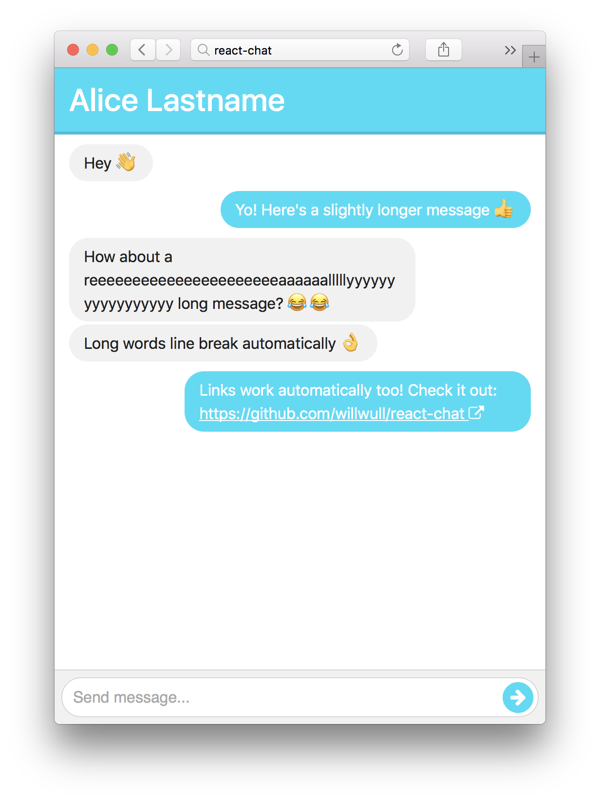

# react-chat
A responsive chat/messenger component made with React with Firebase as the back end.

The chat component (`ChatPanel.js`) will adapt its size to its container component/div/whatever by filling it out completely. The chat component itself isn't dependent on firebase, so feel free to steal it and hook it up to your own set up.

## How to try out locally
You can try it out at the link above, but if you want to try it out locally, just follow these steps:

1. Install NodeJS.
2. Clone this repo and type `npm install` in your terminal, inside the repo directory.
3. `npm start`.
